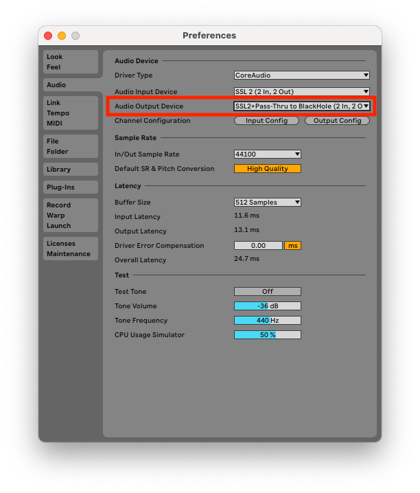
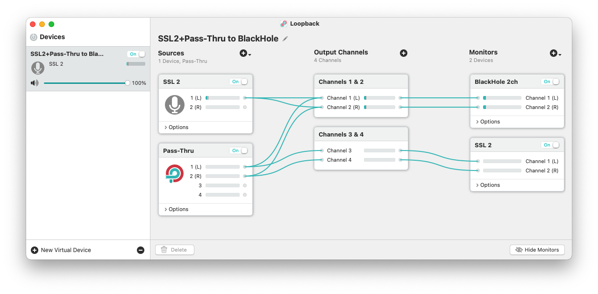

# 声劇等ライブ配信におけるPCからの配信環境について

本記事では、[ボイコネ](https://boikone.jp/)などの音声配信サービスに、効果音・BGMなどを含めて、PCから配信するための機器の接続・設について解説します。ループバック機能のないオーディオインターフェースでいかにループバックを実現するか、ド素人なりに試行錯誤して辿りつい方法です。Loopbackというアプリに依存するため、対象はmacOS限定です。

<author>著者: スナイパー</author>
<address>連絡先: sniper-voice@protonmail.com</address>

## きっかけ

これまで、配信時には[YAMAHA AG03](https://jp.yamaha.com/products/music_production/webcasting_mixer/ag03/index.html)という、ネット配信では定番のオーディオインターフェースを使っていたのですが、ちょっとゆえあって、[SSL2](https://www.solidstatelogic.com/products/ssl2)に変えました。しかし、変えてみると、これまでのやりかたではうまくいかないことがわかってきました。理由は、AG03とSSL2の機能の違いです。

AG03の特徴のひとつに、PC上で再生される音とマイクからの入力を合成して配信できる、ループバック機能があります。一方、SSL2には、そのような便利な機能はありません。違う機種に変えてみて、改めて、AG03はほんとうに便利な機械だったんだなあということを実感しました。PCでの配信をこれからはじめるという方にとりあえず推薦するなら、やはりAG03だと思います。

ただ、AG03でのループバックモードでの配信について改めて考えると、声劇のような多人数同時配信では、他の人の声も拾って自分の端末から再配信していることになるはずなので、共演者の声が二重に聴こえてしまうのではないかという懸念があります。自分の過去の配信でそういう問題が出ていなかったのは、ちょっと不思議です。(もしくは問題が出ていたのに気付かなかった?)

この記事で説明する方法では、純粋に自分のマイクの音とDAW(デジタル・オーディオ・ワークステーション=音楽制作ソフト)からの音のみを配信するので、他の演者の音声を二重に配信する心配はありません。

## LoopbackとBlackHoleでループバックを実現する

BGM・SEのルーティングとミックスをいかにシンプルな構成で実現するか。これにいろいろ苦心しましたが、なかなか完璧な答に辿り着けませんでした。が、[Loopback](https://rogueamoeba.com/loopback/)というアプリに出会って、ついにやりたいことが簡潔に実現できました。

Loopbackを使えば、オーディオデバイスやアプリのオーディオ出力を繋いでまとめたり、スプリットしたりが自由にできます。チャンネルごとに配線できるので、モノラルの音声をステレオに変換したり、ステレオをモノラルにまとめたりもできます。Loopbackはそれ自体、仮想オーディオ出力デバイスとして使えます。
  
もうひとつキーになるソフトが、[BlackHole](https://existential.audio/blackhole/)という仮想オーディオデバイスで、これひとつで出力デバイス兼入力デバイスとして機能します。このデバイスに対して音を流し込むと、このデバイスを入力として使っているアプリにその音をそのまま取り込めます。つまり、Loopback上でミックスした音をブラウザ等から配信できるのです。

LoopbackとBlackHoleを合わせれば、およそ配信時にやりたいどんな構成でも実現できると思います。

マイクの入力は、オーディオインターフェースを通じて、図1のVoiceというラベルのついた線でLoopbackに流し込みます。

BGM・SEは、音源を再生できるアプリならなんでもいいのですが、わたしは、[PC mini](http://akai-pro.jp/apcmini/)というMIDIコントローラーについてきた[Ableton Live Lite](https://www.ableton.com/ja/products/live-lite/)というDAWを使っています。DAWの出力デバイスを図2のようにLoopbackにすると、LoopbackのPass-Thruソースから信号が入ってきます(後述)。

それらの信号は、図3のようにLoopback上でミックスされ、BlackHoleに再出力されます(Channels 1&2)。オーディオインターフェースからの入力(マイク)をオーディオインターフェースにもどしてしまうと、モニタリング時に遅延が生じて気持ち悪いので、オーディオンターフェースからの音はBlackHoleにのみ流します。逆にPath-Thruから入ってきたBGM・SEは、二手に分岐させて片方をオーディオインターフェースに流します(Channels 3&4)。BlackHoleはブラウザへの入力用、オーディオインターフェースはBGM・SEのモニター用です。

PCのデフォルト出力は図4のようにオーディオインターフェースを直接指定します。Loopbackを指定すると共演者の音声まで再配信してしまうことになるので注意してください。逆に個人配信のフリートークなどで、PC上で再生される音すべて拾ってストリーミングしたい場合は、Loopbackを指定すれば良いです。

はオーディオインターフェースへダイレクトに出す")

SSL2には、XLRケーブル入ってきた音と、USBから入ってきた音(=PCからの出力)をどの程度の割合でスピーカーやヘッドフォンに出すかをモニターミックスノブで調整する機能が搭載されています。この構成では、自分の声は、オーディオインターフェースでダイレクトニモニター、BGM・効果音はPCからUSBを通って流れてくるくるため、モニターミックスノブは、INPUTとUSB
  を半々にしておきます。これで、共演者の声を含めすべての音声をモニタリングできるようになります。

### ミュートの実現方法

声劇中、人のセリフの間は自分のマイクをミュートしておきたいですよね。PCからの配信では、ブラウザ上のミュートボタンをマウスでクリックすると「カチッ」という音が入ってしまうし、操作も煩雑なのでなるべく避けたいです。AG03では、フェーダーを下げるという操作でミュートができていました。SSL2にもチャンネルごとにゲインノブがあるので、これを0にすればミュートできる…と思っていたのです。ところが、SSL2のゲインノブは0まで下げてもミュートにならず、うっすら音が入ってきてしまうのです。これはそういう[仕様](https://solidstatelogic.zendesk.com/hc/en-us/articles/360018471777-I-still-see-meters-when-gain-is-all-the-way-down)のようです。なので、別の方法でミュートを実現する必要があります。

まず、パッと思いついたのが、パッシブプリアンプと呼ばれる、信号増幅を行なわない純粋にレベル調整のみを行う装置をマイクとの間に挟めば、AG03のフェーダーと同じような機能を実現できるのではないかということでした。そこで、[Behringer社のMONITOR1](https://www.behringer.com/product.html?modelCode=P0C9G)という商品を試してみました。ところが、これはノブやスイッチの操作をしたときに「バリバリッ」という強烈なノイズが走ってしまいます。これでは、目的の用途には使えません(※すぐ返品しました)。

そこで、もっといい何かがないかと探していたところ見つけたのが、[TOMOCA TCC-60](https://www.tomoca.co.jp/brand/tomoca-p/top-cough/tcc-60/)。これはいわゆる[カフ](https://ja.wikipedia.org/wiki/%E3%82%AB%E3%83%95%E3%83%9C%E3%83%83%E3%82%AF%E3%82%B9)というやつで、プロのナレーターの方なんかも現場で使っているようなものです。商品説明にもON/OFF時に雑音を発生しないとあったため、これならイケるかも、と思って試してみたところ、見事に機能してくれました。すばらしい商品です。使っていると、なんかプロっぽい気分になれるという副次効果もあります。ただし、ニッチ向けの商品のため約4万円とかなり高額です。

## 試したけど良くなかった方法

Loopbackを知るまでにいろいろ試行錯誤したものの、うまくいかなかった方法も参考のために残しておきます。

### オーディオインターフェースのチャンネル2にDAWからの出力を流し込んでマイクと効果音をミックスする方法

わたしの使っているオーディオインターフェースSSL2には入力が2chあって、lchぶん空きがあるため、そこに効果音・BGMを流し込めばやりたいことができるのではと考えてやってみました。接続には、ミニプラグ(オス)-XLR(オス)変換ケーブルを使いました。

しかしこれだと、どうしてもチャンネル2にノイズがのってしまったり、まともに音が入らなかったりしてダメでした。変換ケーブルの品質問題かと思い3種類くらい試してみたのですが、どれもダメです。フォン端子はステレオなのに対しXLRはモノラルです。このあたりの違いがノイズの原因なのではないかと思っています。

### DAW上でマイクと効果音をミックスした上で配信する方法

もう一つは、Ableton Liveのようなオーディオインターフェースにマイクからの入力を流し込んでミックスした上で、ブラウザに出力する方法です。これは可能ではあるのですが、DAW必須というの制約がめんどうです。というのも、声劇以外の用途でもマイクと他の音を混ぜて流したいことがあり、それらのケースにはDAWはオーバースペックだからです。その点、より広いケースを柔軟にカバーできるLoopbackを真ん中に置く方が扱いやすいです。また、iこの構成では、マイクの音をDAW経由でモニターすることになるため遅延が入ります。バッファーのサンプル数を下げることである程度軽減はできますが、やはり気になります。

## ソフト

### [Loopback](https://rogueamoeba.com/loopback/)

ライブ配信時にソフトやデバイスの音声入出力を任意に繋いでチャンネルごとにミックスできる超絶便利アプリ。これ自身仮想オーディオドライバーとして機能します。

### [BlackHole](https://existential.audio/blackhole/)

仮想オーディオドライバー。スピーカーであると同時にマイクのように機能します。BlackHaleを入力デバイスとして使うと、BlackHoleに向けて出力した音がそのまま入力されます。これにより、ミックスした音をブラウザ等に食わせてネット配信できます。

[Ableton Live Lite](https://www.ableton.com/ja/products/live-lite/)

APC miniに付いてくるDAW。主に配信用ポン出しソフトとして使います。

## 機械

### [SSL2](https://www.solidstatelogic.com/products/ssl2)

2チャンネルの入力ポートを備えたオーディオインターフェース。マイク等からの入力音声とDAW等からの出力音声をミックスしてモニタリングできます(ミックス量はノブで調整可)。

### [APC mini](http://akai-pro.jp/apcmini/)

Ableton Liveに接続して使うMIDIコントローラーです。64個のボタンがついており、ソフト上でそれぞれに音源を割り当てて再生したり、フェードをかけるなどの操作行います。

[TOMOCA TCC-60](https://www.tomoca.co.jp/brand/tomoca-p/top-cough/tcc-60/)

フェーダーで信号のON/OFFを切り替えられます。切り替え時にノイズが発生しません。マイクをミュートするために使います。
